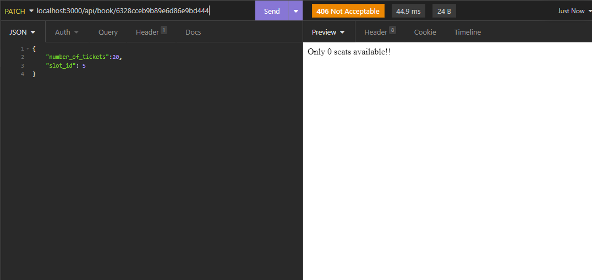

# Circlys-challenge-Movies-API
 A simple API endpoint for users to list movies, check availability and reserve a movie.

Steps to run the project:

1) git clone
2) npm i 
3) create .env file and put "DATABASE_URL" varable with you mangodb url

test cases 

1) create movie 
    
2) get movies 
    
3) get one movie 
    
4) book movie with available seats 
    
5) book movie with no available seats 
    
6) remove movie
    